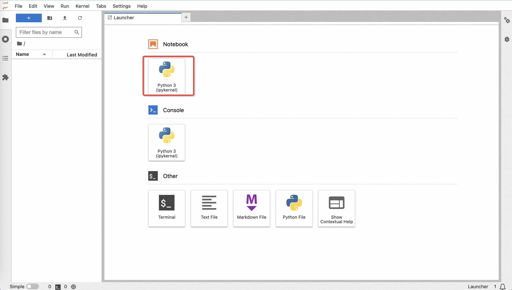

# 通义千问

## Introduction
https://help.aliyun.com/zh/dashscope/developer-reference/api-details

### Prerequisites
1. [开通DashScope并创建API-KEY](https://help.aliyun.com/zh/dashscope/developer-reference/activate-dashscope-and-create-an-api-key?spm=a2c4g.11186623.0.i2)
2. 申请通义千问模型API权限，[点此申请](https://help.aliyun.com/zh/dashscope/support/faq?spm=a2c4g.11186623.0.i23#vuoFh)

### Deploy Jupyter
1. create a Jupyter Notebook Deployment (CPU)
```bash
kubectl apply -f notebook.yaml
```

2. wait deployment ready
```bash
kubectl get po |grep notebook

# NAME                       READY   STATUS    RESTARTS   AGE
# notebook-d68d854c9-ptvtp   1/1     Running   0          8m5s
```

3. get ExternalIP
```bash
kubectl get svc notebook-svc --output jsonpath='{.status.loadBalancer.ingress[0].ip}'
```

4. 调用通义千问  
a. 将${ExternalIP}替换为第三步获取的IP地址，在浏览器中打开连接(http://${ExternalIP}:8888)。  
b. 创建Notebook，参考[tongyi.ipynb](tongyi.ipynb)调用通义千问API。  


